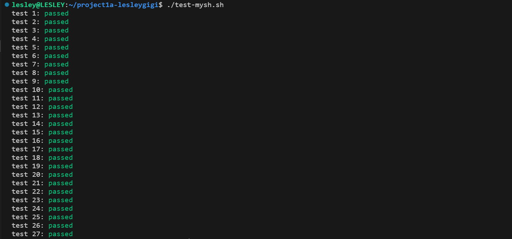
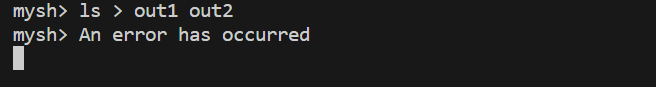
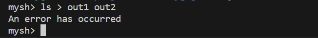
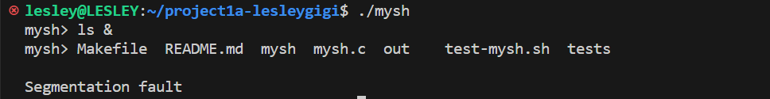
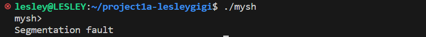
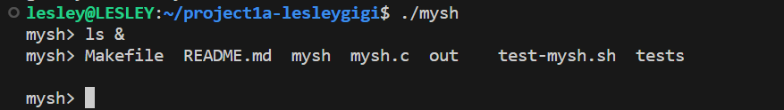

[](https://classroom.github.com/a/KFHwm5Zu)
# A Unix Shell



##### Pipe

管道允许多个命令按顺序执行，一个命令的输出作为下一个命令的输入。

###### 后台作业检测

检查输入命令是否以 `&`结尾。如果是，命令被标记为后台作业，并且从输入字符串中删除了`&` 

```c
//check if the command end with '&'
int bg=0;
if(strlen(input)>1&&input[strlen(input)-2]=='&'){
    bg=1;
    input[strlen(input)-2]='\0';
}
```

###### 分割子命令

使用`|`字符作为分隔符对输入命令进行标记化。这将命令拆分成单独的子命令，这些子命令将在管道中顺序执行。

```c
char *cmds[MAX_INPUT_LENGTH];
char *token=strtok(input,"|");
int cmd_nums=0;
while(token!=NULL){
    cmds[cmd_nums++]=token;
    token=strtok(NULL,"|");
}
```

###### 执行内置命令

检查第一个子命令是否是内置 Shell 命令，如 `exit`、`cd`、`pwd` 或 `wait`。如果是，将调用适当的内置函数。这些内置命令不参与管道。

```c
char tmp[MAX_INPUT_LENGTH];
strcpy(tmp,input);
char *built_in_cmd=strtok(tmp," \t\n");
char *next=strtok(NULL," \t\n");
if(strcmp(built_in_cmd,"exit")==0){
    if(next){
        myerror();
        return;
    }else{
        exit(0);
    }
}else if(strcmp(built_in_cmd,"cd")==0){
    mycd(next);
    return;
}else if(strcmp(built_in_cmd,"pwd")==0){
    if(next){
        myerror();
    }else{
        mypwd();
    }
    return;
}else if(strcmp(built_in_cmd,"wait")==0){
    if(next){
        myerror();
    }else{
        mywait();
    }
    return;
}
```

###### 管道执行

使用fork为为每个子命令创建子进程，设置管道将一个进程的标准输出连接到下一个进程的标准输入

- 子进程：负责执行一个子命令，根据需要重定向其标准输入和输出

- 父进程：协调子进程的执行以管理管道，等待每个子进程完成，确保管道中的命令按顺序执行

```c
int pipefds[2];
int prev_pipe_read = -1;

for (int i = 0; i < cmd_nums; i++) {
    pipe(pipefds);

    int pid = fork();
    if (pid == 0) {
        // Child process
        if (i > 0) {
            // Redirect stdin from the previous pipe
            close(STDIN_FILENO);
            dup2(prev_pipe_read, STDIN_FILENO);
            close(prev_pipe_read);
        }

        if (i < cmd_nums - 1) {
            // Redirect stdout to the current pipe
            close(STDOUT_FILENO);
            dup2(pipefds[1], STDOUT_FILENO);
            close(pipefds[1]);
        }

        // Execute the command
        exec_cmd(cmds[i]);

        exit(1);
    } else if (pid > 0) {
        // Parent process
        if (prev_pipe_read != -1) {
            close(prev_pipe_read);
        }

        // Save the read end of the current pipe for the next iteration
        prev_pipe_read = pipefds[0];

        // Close the write end of the pipe
        close(pipefds[1]);

        // Wait for the child to complete
        if(!bg){
            //wait for the child to complete if not a background job
            waitpid(pid,NULL,0);
        }else{
            if(num_bg_jobs<MAX_BG_JOBS){
                bg_jobs[num_bg_jobs++]=pid;//add the background job to the list
            }else{
                myerror();
            }
        }
    }
}
```

###### 管理后台作业

如果命令标记为后台作业，则将其添加到后台作业列表异步执行


**以下是关于程序的实现过程、遇到的一些问题以及如何修正的简述**

##### Basic Shell

首先根据命令函参数判断程序是以交互式输入执行还是批处理式执行，若是前者，则启动一个死循环，重复打印`mysh> `，解析用户输入，执行相应命令。

```c
char input[MAX_INPUT_LENGTH];
if(argc==2){//batch mode: read from a batch file
    FILE *batch_file=fopen(argv[1],"r");
    if(batch_file==NULL){
        write(STDERR_FILENO, error_message, strlen(error_message));
        exit(1);
    }
    while(fgets(input,sizeof(input),batch_file)!=NULL){
        write(STDOUT_FILENO,input,strlen(input));
        exec_cmd(input);
    }
    fclose(batch_file);
}else if(argc==1){
    while(1){
        printf("mysh> ");
        fflush(stdout);
        if(fgets(input,sizeof(input),stdin)==NULL){//ctrl+D
            break;
        }
        exe_cmd(input);
    }
}else{
    write(STDERR_FILENO, error_message, strlen(error_message));
    exit(1);
}
```

##### Built-in Commands

使用`strtok`分割字符串，解析输入的参数。

```c
char *token=strtok(cmd," \t\n");//tokenize by whitespace and newline
```

实现内置命令。

```c
if(strcmp(args[0],"exit")==0){
    if(i>1){
        myerror();
    }else{
        myexit();
    }
}else if(strcmp(args[0],"cd")==0){
    if(args[1]==NULL){
        char *home_dir=getenv("HOME");
        chdir(home_dir);
    }else{
        if(chdir(path)!=0){
            myerror();
        }
    }
}else if(strcmp(args[0],"pwd")==0){
    if(i>1){
        myerror();
    }else{
        char cur_dir[MAX_INPUT_LENGTH];
        getcwd(cur_dir,sizeof(cur_dir));
        int len=strlen(cur_dir);
        cur_dir[len]='\n',cur_dir[len+1]='\0';
        write(STDOUT_FILENO, cur_dir, strlen(cur_dir));
    }
}else if(strcmp(args[0],"wait")==0){
    wait(NULL);
}
```

##### Redirection

`>`将程序的输入重定向到输出文件。如果在运行程序之前输出文件已经存在，则覆盖文件；如果没有置顶输出文件，则打印错误信息。

已知以下是一些在mysh中不应起作用的重定向操作，那么可得知在mysh中使用重定向时，`>`后面应只有一个输出文件名

```shell
$ ls > out1 out2
$ ls > out1 out2 out3
$ ls > out1 > out2
```

检查命令行参数中是否存在重定向操作符 ">"，如果存在，则将标准输出重定向到指定的文件，并确保没有多余的参数。如果存在多余的参数，将会写入错误消息并退出程序。

```c
int redirect=0;
char *outfile=NULL;
for(int i=0;i<argc;i++){
    if(strcmp(args[i],">")==0){
        redirect=1;
        outfile=args[i+1];
        if(i+2<argc){
            write(STDERR_FILENO, error_message, strlen(error_message));
            exit(1);
        }
        args[i]=NULL;
        break;
    }
}
if(redirect){
    int fd=open(outfile,O_WRONLY|O_CREAT|O_TRUNC,666);
    if(fd==-1){
        write(STDERR_FILENO, error_message, strlen(error_message));
        exit(1);
    }
    close(STDOUT_FILENO);
    dup2(fd,STDOUT_FILENO);//Copy file descriptor fd to standard output file descriptor STDOUT_FILENO
    close(fd);
}
```

在测试过程中发现错误信息和提示符输出在同一行的情况



应是父进程没有等待子进程执行完毕导致的

在处理进程时加上`wait(NULL)`之后解决了上述问题

```c
int pid=fork();
if(pid==0){//child process
    myredirect(i,args);
    execvp(args[0],args);
    write(STDERR_FILENO, error_message, strlen(error_message));
    exit(1);
}else{//parent process;
    wait(NULL);
}
```



##### Background Jobs

添加一个子进程标识符数组来管理后台作业

```c
#define MAX_BG_JOBS 8
int bg_jobs[MAX_BG_JOBS];
int num_bg_jobs=0;
```

在解析命令时，检查末尾是否有`&`

```c
//check if the command end with '&'
int bg=0;
if(strlen(cmd)>1&&cmd[strlen(cmd)-2]=='&'){
    bg=1;
    cmd[strlen(cmd)-2]='\0';
}
```

即使有一些作业在后台运行，mysh仍然可以接收新的命令

```c
if(!bg){
    //wait for the child to complete if not a background job
    waitpid(pid,NULL,0);
}else{
    if(num_bg_jobs<MAX_BG_JOBS){
        bg_jobs[num_bg_jobs++]=pid;//add the background job to the list
    }else{
        myerror();
    }
}
```

实现内置命令`wait`，当用户在`mysh`中输入`wait`时，`mysh`将等待所有后台作业完成

```c
void mywait(){
    for(int i=0;i<num_bg_jobs;i++){
        int status;
        waitpid(bg_jobs[i],&status,0);
    }
    num_bg_jobs=0;
}
```

当我尝试测试时，发现后台作业的输出与`mysh`提示语显示在同一行，当我再次键入回车时，出现了参数错误，但是我明明已经在输出`mysh> `后刷新缓冲区



之后我又发现当我只键入回车时，也会出现错误



调试后发现是在`exec_cmd`中没有处理参数为空的情况。

```c
void exec_cmd(char *cmd){
    char *args[MAX_INPUT_LENGTH];
    //tokenize by whitespace and newline
    char *token=strtok(cmd," \t\n");
    int i=0;
    while(token!=NULL){
        args[i++]=token;
        token=strtok(NULL," \t\n");
    }
    if(i==0){
        return;
    }
    ......
}
```

修改后运行正确



##### Program Errors

`mysh`应能捕捉任何指定的错误，定义错误输出函数，当`mysh`检测到输入语法错误时，将打印错误信息。

```c
void myerror(){
    char error_message[30] = "An error has occurred\n";
    write(STDERR_FILENO, error_message, strlen(error_message));
}
```

##### White Space

之前在解析字符串时，只考虑空格、制表符与换行符分隔参数的情况，没有考虑到命令与特殊字符之间可以有零个或多个空格，现增加处理命令与特殊字符之间没有空格的情况。

```c
//将命令分解为参数，并在遇到输出重定向符号 > 时将其单独作为参数添加到参数列表中
while(token!=NULL){
    char *rd=strchr(token,'>');
    if(rd!=NULL){
        char *ttoken=token;
        token=rd+1;
        (*rd)='\0';
        if((*ttoken)!='\0'){
            args[i++]=ttoken;
        }
        args[i++]=">";
    }
    if((*token)!='\0'){
        args[i++]=token;
    }
    token=strtok(NULL," \t\n");
}
```

##### Defensive Programming and Error Messages

检测错误，并根据具体情况选择继续处理或退出

shell程序的命令行参数不正确

```c
int main(int argc, char *argv[]){
    char input[MAX_INPUT_LENGTH*2];
    if(argc==2){//batch mode: read from a batch file
        ......
    }else if(argc==1){//interactive mode
        ......
    }else{
        myerror();
        exit(1);
    }
    return 0;
}
```

子进程命令不存在或无法执行

```c
if(pid==0){//child process
    myredirect(i,args);
    execvp(args[0],args);//Will not return
    myerror();
    exit(1);
}
```

输入过长

```c
int main(int argc, char *argv[]){
    char input[MAX_INPUT_LENGTH*2];
    if(argc==2){//batch mode: read from a batch file
        FILE *batch_file=fopen(argv[1],"r");
        .....
        while(fgets(input,sizeof(input),batch_file)!=NULL){
            if(strlen(input)>MAX_INPUT_LENGTH){
                myerror();
                continue;
            }
            ......
        }
        fclose(batch_file);
    }else if(argc==1){//interactive mode
        ......
    }else{
        ......
    }
    return 0;
}
```

